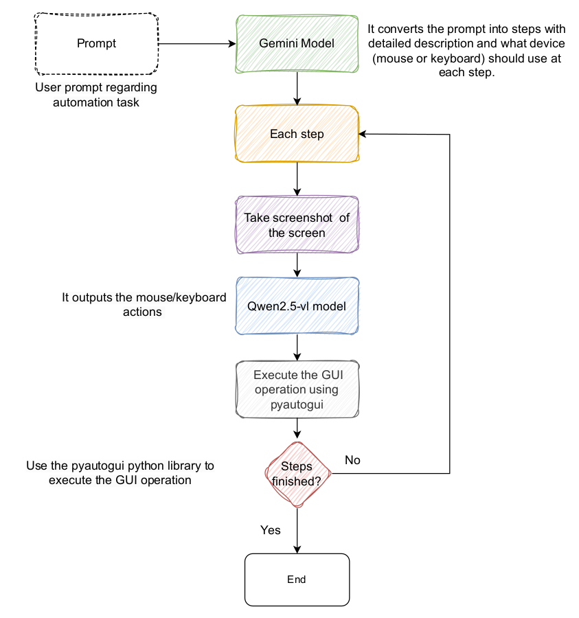

# Web-operator

Recently, OpenAI has released an operator agent that can browse the web and perform actions based on prompts. My approach differs from these agents and the browser-use library because my approach has the potential to automate all sorts of computer tasks. As part of the development, I built a basic library called web-operator that performs minimal computer tasks.

Disclaimer: It is important to note that this is a starting point and requires further development to handle more complex scenarios.

A specific use case I envision is web search. For example, if we need to perform a web search on a specific topic, we often use Selenium or Playwright for web scraping. However, we frequently get blocked, especially by Google sites. If we can search the way a human does, these sites may not detect scraping.

Disclaimer: Currently, the library can navigate sites based on instructions, but data scraping is not yet implemented.
Design

## Architecture of the library




At the heart of this library lies the Qwen 2.5 VL 7B Instruct model. This powerful, 7-billion-parameter vision-language model can understand both image and text content. It goes beyond simple object detection by analyzing the structure and content of images, including text, charts, and layouts. This capability makes it well-suited for automating computer tasks, where understanding the visual context of a screen or interface is crucial. 

## Requirement
This required an Nvidia GPU with 12GB of VRAM to run the Hugging Face model locally. It also required the Gemini API.

## Installation

1. Setup conda enviornment with python 3.12

2. Web-operator and other software installation

    ```
    conda config --add channels pytorch
    conda config --add channels conda-forge
    conda config --add channels nvidia

    python -m pip install --upgrade web-operator
    python -m pip install git+https://github.com/huggingface/transformers@f3f6c86582611976e72be054675e2bf0abb5f775
    
    
    ```

3. Environment Setup

    This guide explains how to set up and manage environment variables for your project using python-dotenv.

    a. Install the python-dotenv library using pip:

    ```
    pip install python-dotenv
    ```
    b. Create a .env file in your project's root directory with the following structure:
    ```
    GEMINI_API_KEY=your_openai_api_key
    ```

    c. Add .env to your .gitignore file to prevent accidentally committing sensitive information:

    d. code for load environment variables 
    ```
    from dotenv import load_dotenv
    import os
    load_dotenv()
    ```

## How to change the basic config

1. print config
```
print(supervisor.config)

#Typical output
{'debug': False, 'step_creation_model': 'gemini-2.0-pro-exp-02-05', 'computer_use_model': 'Qwen/Qwen2.5-VL-7B-Instruct'}
```

2. modify

```
supervisor.config["debug"] = True
print(supervisor.config)

#Typical output
{'debug': False, 'step_creation_model': 'gemini-2.0-pro-exp-02-05', 'computer_use_model': 'Qwen/Qwen2.5-VL-7B-Instruct'}
```

## Example

```
from web_operator.supervisor import Supervisor
from dotenv import load_dotenv

load_dotenv()  

query = """
action 1: open the firfox web browser
action 2: click on the address bar
action 3: type scholar.google.com 
action 4: press enter for search
action 5: type openai in the search box of google scholar
action 6: press enter for search
action 7: close the browser
"""
user_query = query

supervisor = Supervisor()

supervisor.config["debug"] = True

# Make sure the config is changed before the configure function call.
supervisor.configure()
supervisor.run(user_query)
```
## Medium article
Here is the link for the medium article regarding the library: https://medium.com/intro-to-artificial-intelligence/my-attempt-to-build-a-computer-use-capability-using-an-llm-35441b61e535